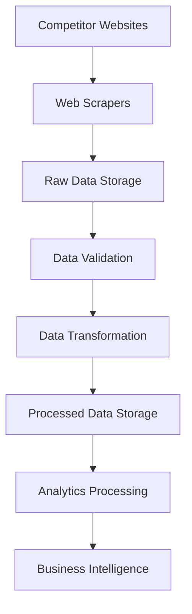

# 📚 Documentación Técnica - Competitive Price Intelligence Platform

## 📋 Índice

1. [Arquitectura del Sistema](#arquitectura-del-sistema)
2. [Componentes Principales](#componentes-principales)
3. [Flujo de Datos](#flujo-de-datos)
4. [Configuración Avanzada](#configuración-avanzada)
5. [API Reference](#api-reference)
6. [Troubleshooting](#troubleshooting)
7. [Optimización](#optimización)
8. [Seguridad](#seguridad)
9. [Monitoreo](#monitoreo)
10. [Deployment](#deployment)

## 🏗️ Arquitectura del Sistema

### Diagrama de Arquitectura

```
┌─────────────────────────────────────────────────────────────────┐
│                    COMPETITIVE PRICE INTELLIGENCE              │
│                           PLATFORM                              │
└─────────────────────────────────────────────────────────────────┘

┌─────────────────┐    ┌─────────────────┐    ┌─────────────────┐
│   DATA SOURCES  │    │   PROCESSING    │    │   STORAGE       │
│                 │    │                 │    │                 │
├─────────────────┤    ├─────────────────┤    ├─────────────────┤
│ • Amazon        │───▶│ • Scrapers      │───▶│ • MinIO/S3      │
│ • MercadoLibre  │    │ • Transformers  │    │ • DuckDB        │
│ • eBay          │    │ • Validators    │    │ • Delta Lake    │
│ • APIs          │    │ • Enrichers     │    │ • Parquet       │
└─────────────────┘    └─────────────────┘    └─────────────────┘
         │                       │                       │
         ▼                       ▼                       ▼
┌─────────────────┐    ┌─────────────────┐    ┌─────────────────┐
│   ORCHESTRATION │    │   ANALYTICS     │    │   PRESENTATION  │
│                 │    │                 │    │                 │
├─────────────────┤    ├─────────────────┤    ├─────────────────┤
│ • Airflow       │    │ • DBT Models    │    │ • Grafana       │
│ • Prefect       │    │ • ML Models     │    │ • FastAPI       │
│ • Cron Jobs     │    │ • Alerting      │    │ • Dashboards    │
│ • Event Driven  │    │ • Reporting     │    │ • Notifications │
└─────────────────┘    └─────────────────┘    └─────────────────┘
```

### Capas del Sistema

#### 1. Data Ingestion Layer
- **Web Scrapers**: Selenium, Scrapy, Requests
- **API Connectors**: REST APIs, GraphQL
- **File Importers**: CSV, JSON, XML
- **Real-time Streams**: WebSockets, Kafka

#### 2. Processing Layer
- **Data Validation**: Great Expectations
- **Data Transformation**: Pandas, PySpark
- **Data Enrichment**: External APIs, ML Models
- **Data Quality**: Automated checks, alerts

#### 3. Storage Layer
- **Raw Data**: MinIO/S3 (Bronze)
- **Processed Data**: DuckDB (Silver)
- **Analytics Data**: Delta Lake (Gold)
- **Metadata**: PostgreSQL

#### 4. Analytics Layer
- **Data Models**: DBT transformations
- **ML Models**: Price prediction, anomaly detection
- **Business Logic**: Competitive analysis, pricing strategies
- **Reporting**: Automated reports, dashboards

#### 5. Presentation Layer
- **APIs**: FastAPI REST endpoints
- **Dashboards**: Grafana visualizations
- **Alerts**: Email, Slack, Webhooks
- **Mobile**: React Native app (future)

## 🔧 Componentes Principales

### 1. Scrapers

#### BaseScraper
```python
class BaseScraper(ABC):
    """Clase base para todos los scrapers."""
    
    def __init__(self, config, competitor_name):
        self.config = config
        self.competitor_name = competitor_name
        self.session = None
        self.driver = None
    
    @abstractmethod
    def _scrape_category(self, category: str) -> List[Dict]:
        """Implementar scraping específico."""
        pass
    
    @abstractmethod
    def _extract_product_data(self, element) -> Dict:
        """Extraer datos de producto."""
        pass
```

#### AmazonScraper
- **Selectors**: CSS selectors específicos de Amazon
- **Rate Limiting**: Respeto a robots.txt
- **Anti-detection**: User-Agent rotation, delays
- **Data Extraction**: Precios, ratings, reviews, ASIN

#### MercadoLibreScraper
- **Selectors**: CSS selectors específicos de ML
- **Currency**: Peso argentino (ARS)
- **Features**: Condición del producto, envío
- **Data Extraction**: ML ID, precios, disponibilidad

### 2. Data Transformers

#### DataTransformer
```python
class DataTransformer:
    """Transformación y limpieza de datos."""
    
    def transform_all(self, raw_data: Dict) -> Dict:
        """Transformar todos los datos."""
        return {
            'products': self.transform_products(raw_data),
            'prices': self.transform_prices(raw_data),
            'competitors': self.transform_competitors(raw_data)
        }
    
    def clean_text(self, text: str) -> str:
        """Limpieza de texto."""
        pass
    
    def normalize_prices(self, prices: List) -> List:
        """Normalización de precios."""
        pass
```

### 3. Data Loaders

#### DataLoader
```python
class DataLoader:
    """Carga de datos en data lakehouse."""
    
    def load_all(self, data: Dict) -> bool:
        """Cargar todos los datos."""
        self.load_to_minio(data['raw'])
        self.load_to_duckdb(data['processed'])
        self.load_to_delta(data['analytics'])
        return True
    
    def load_to_minio(self, data: List) -> bool:
        """Cargar datos raw a MinIO."""
        pass
    
    def load_to_duckdb(self, data: List) -> bool:
        """Cargar datos procesados a DuckDB."""
        pass
```

### 4. Analytics Engine

#### PriceAnalyzer
```python
class PriceAnalyzer:
    """Análisis de precios y competitividad."""
    
    def analyze_competitiveness(self) -> Dict:
        """Análisis completo de competitividad."""
        return {
            'price_positioning': self.analyze_price_positioning(),
            'market_share': self.calculate_market_share(),
            'price_elasticity': self.analyze_price_elasticity(),
            'trends': self.analyze_price_trends()
        }
    
    def detect_significant_changes(self, data: Dict) -> List:
        """Detectar cambios significativos."""
        pass
```

## 🔄 Flujo de Datos

### 1. Data Ingestion Flow



### 2. Processing Pipeline

```python
# Pipeline completo
def run_full_pipeline():
    # 1. Scraping
    scraped_data = scraper_manager.scrape_all_competitors()
    
    # 2. Transformation
    transformed_data = transformer.transform_all(scraped_data)
    
    # 3. Loading
    load_success = loader.load_all(transformed_data)
    
    # 4. Analytics
    analysis_results = analyzer.analyze_competitiveness()
    
    # 5. Reporting
    report_generator.generate_all_reports(analysis_results)
    
    # 6. Alerts
    send_alerts(analysis_results)
```

### 3. Data Quality Flow

```python
# Validación de calidad
def validate_data_quality():
    # Raw data validation
    raw_quality = validate_raw_data()
    
    # Processed data validation
    processed_quality = validate_processed_data()
    
    # Analytics validation
    analytics_quality = validate_analytics_data()
    
    # Generate quality report
    generate_quality_report({
        'raw': raw_quality,
        'processed': processed_quality,
        'analytics': analytics_quality
    })
```

## ⚙️ Configuración Avanzada

### 1. Scraping Configuration

```yaml
scraping:
  delay: 2  # segundos entre requests
  timeout: 30  # timeout de requests
  retries: 3  # número de reintentos
  user_agent_rotation: true
  use_proxies: false
  max_concurrent_requests: 16
  download_delay: 1
  respect_robots_txt: true
  
  competitors:
    amazon:
      enabled: true
      base_url: "https://www.amazon.com"
      categories: ["electronics", "books", "home"]
      max_pages: 10
      products_per_page: 48
```

### 2. Database Configuration

```yaml
database:
  type: "duckdb"
  url: "duckdb:///data/warehouse.db"
  pool_size: 10
  max_overflow: 20
  pool_timeout: 30
  echo: false
```

### 3. Storage Configuration

```yaml
storage:
  type: "minio"
  endpoint: "localhost:9000"
  access_key: "minioadmin"
  secret_key: "minioadmin"
  bucket_name: "price-intelligence"
  secure: false
  region: "us-east-1"
```

### 4. Analytics Configuration

```yaml
analytics:
  competitiveness:
    price_threshold: 0.10  # 10% de diferencia
    market_share_calculation: true
    price_elasticity_analysis: true
    
  alerts:
    price_drop_threshold: 0.15  # 15% de caída
    price_increase_threshold: 0.20  # 20% de aumento
    new_competitor_threshold: 0.05  # 5% de diferencia
```

## 🔌 API Reference

### 1. Main API Endpoints

#### GET /api/v1/status
```bash
curl -X GET "http://localhost:8000/api/v1/status"
```

Response:
```json
{
  "status": "healthy",
  "timestamp": "2024-01-15T10:30:00Z",
  "version": "1.0.0",
  "services": {
    "scrapers": "active",
    "database": "connected",
    "storage": "available"
  }
}
```

#### POST /api/v1/scrape
```bash
curl -X POST "http://localhost:8000/api/v1/scrape" \
  -H "Content-Type: application/json" \
  -d '{"competitors": ["amazon", "mercadolibre"]}'
```

#### GET /api/v1/analytics/competitiveness
```bash
curl -X GET "http://localhost:8000/api/v1/analytics/competitiveness"
```

#### GET /api/v1/reports/latest
```bash
curl -X GET "http://localhost:8000/api/v1/reports/latest"
```

### 2. Scraper API

#### GET /api/v1/scrapers/status
```bash
curl -X GET "http://localhost:8000/api/v1/scrapers/status"
```

#### POST /api/v1/scrapers/{competitor}/scrape
```bash
curl -X POST "http://localhost:8000/api/v1/scrapers/amazon/scrape"
```

### 3. Analytics API

#### GET /api/v1/analytics/price-trends
```bash
curl -X GET "http://localhost:8000/api/v1/analytics/price-trends?days=30"
```

#### GET /api/v1/analytics/market-share
```bash
curl -X GET "http://localhost:8000/api/v1/analytics/market-share?category=electronics"
```

## 🔧 Troubleshooting

### 1. Common Issues

#### Scraping Issues
```bash
# Error: Connection timeout
# Solución: Aumentar timeout en configuración
scraping:
  timeout: 60  # aumentar de 30 a 60

# Error: Rate limiting
# Solución: Aumentar delay entre requests
scraping:
  delay: 5  # aumentar de 2 a 5

# Error: Anti-bot detection
# Solución: Habilitar rotación de User-Agents
scraping:
  user_agent_rotation: true
  use_proxies: true
```

#### Database Issues
```bash
# Error: Connection pool exhausted
# Solución: Aumentar pool size
database:
  pool_size: 20  # aumentar de 10 a 20
  max_overflow: 30  # aumentar de 20 a 30

# Error: Database locked
# Solución: Verificar conexiones activas
# Reiniciar servicio de base de datos
```

#### Storage Issues
```bash
# Error: MinIO connection failed
# Solución: Verificar configuración
storage:
  endpoint: "localhost:9000"
  access_key: "minioadmin"
  secret_key: "minioadmin"

# Error: Bucket not found
# Solución: Crear bucket
mc mb minio/price-intelligence
```

### 2. Log Analysis

#### Scraper Logs
```bash
# Ver logs de scraping
tail -f logs/scraping.log

# Buscar errores
grep "ERROR" logs/scraping.log

# Ver estadísticas
grep "STATS" logs/scraping.log
```

#### Application Logs
```bash
# Ver logs de aplicación
tail -f logs/app.log

# Buscar errores específicos
grep "Exception" logs/app.log

# Ver logs de rendimiento
grep "PERFORMANCE" logs/app.log
```

### 3. Performance Issues

#### High Memory Usage
```python
# Solución: Optimizar procesamiento por lotes
processing:
  batch_size: 500  # reducir de 1000 a 500
  chunk_size: 50   # reducir de 100 a 50
```

#### Slow Scraping
```python
# Solución: Paralelizar scraping
scraping:
  max_concurrent_requests: 8  # reducir de 16 a 8
  download_delay: 2           # aumentar de 1 a 2
```

#### Database Performance
```sql
-- Solución: Optimizar consultas
-- Crear índices
CREATE INDEX idx_product_competitor ON products(competitor);
CREATE INDEX idx_product_category ON products(category);
CREATE INDEX idx_product_price ON products(price);

-- Analizar tablas
ANALYZE products;
ANALYZE price_history;
```

## ⚡ Optimización

### 1. Performance Optimization

#### Scraping Optimization
```python
# Configuración optimizada
scraping:
  # Paralelización
  max_concurrent_requests: 16
  parallel_workers: 4
  
  # Caching
  cache_enabled: true
  cache_ttl: 3600
  
  # Connection pooling
  connection_pool_size: 20
  connection_timeout: 30
```

#### Database Optimization
```python
# Configuración optimizada
database:
  # Connection pooling
  pool_size: 20
  max_overflow: 30
  pool_timeout: 30
  
  # Query optimization
  query_cache_size: 1000
  query_timeout: 60
  
  # Indexing
  auto_index: true
  index_strategy: "aggressive"
```

#### Storage Optimization
```python
# Configuración optimizada
storage:
  # Compression
  compression: "snappy"
  compression_level: 1
  
  # Partitioning
  partition_by: ["date", "competitor", "category"]
  
  # Caching
  cache_enabled: true
  cache_size: "1GB"
```

### 2. Memory Optimization

#### Data Processing
```python
# Procesamiento por lotes
def process_in_batches(data, batch_size=1000):
    for i in range(0, len(data), batch_size):
        batch = data[i:i + batch_size]
        process_batch(batch)
        gc.collect()  # Garbage collection
```

#### Memory Monitoring
```python
# Monitoreo de memoria
import psutil
import gc

def monitor_memory():
    process = psutil.Process()
    memory_info = process.memory_info()
    
    if memory_info.rss > 1_000_000_000:  # 1GB
        gc.collect()  # Forzar garbage collection
        return "Memory cleanup performed"
    
    return "Memory usage normal"
```

### 3. Network Optimization

#### Connection Pooling
```python
# Pool de conexiones HTTP
import requests
from requests.adapters import HTTPAdapter
from urllib3.util.retry import Retry

session = requests.Session()
adapter = HTTPAdapter(
    pool_connections=20,
    pool_maxsize=20,
    max_retries=Retry(total=3, backoff_factor=0.1)
)
session.mount('http://', adapter)
session.mount('https://', adapter)
```

#### CDN Configuration
```python
# Configuración de CDN para imágenes
image_cdn_config = {
    'base_url': 'https://cdn.example.com',
    'cache_headers': {
        'Cache-Control': 'max-age=86400',
        'ETag': True
    }
}
```

## 🔒 Seguridad

### 1. Authentication & Authorization

#### API Authentication
```python
# JWT Authentication
from fastapi import Depends, HTTPException, status
from fastapi.security import HTTPBearer, HTTPAuthorizationCredentials
import jwt

security = HTTPBearer()

def verify_token(credentials: HTTPAuthorizationCredentials = Depends(security)):
    try:
        payload = jwt.decode(
            credentials.credentials, 
            SECRET_KEY, 
            algorithms=["HS256"]
        )
        return payload
    except jwt.ExpiredSignatureError:
        raise HTTPException(
            status_code=status.HTTP_401_UNAUTHORIZED,
            detail="Token expired"
        )
    except jwt.InvalidTokenError:
        raise HTTPException(
            status_code=status.HTTP_401_UNAUTHORIZED,
            detail="Invalid token"
        )
```

#### Role-Based Access Control
```python
# RBAC Implementation
class Role(Enum):
    ADMIN = "admin"
    ANALYST = "analyst"
    VIEWER = "viewer"

def require_role(required_role: Role):
    def decorator(func):
        def wrapper(*args, **kwargs):
            user_role = get_user_role()
            if user_role < required_role:
                raise HTTPException(
                    status_code=status.HTTP_403_FORBIDDEN,
                    detail="Insufficient permissions"
                )
            return func(*args, **kwargs)
        return wrapper
    return decorator
```

### 2. Data Security

#### Data Encryption
```python
# Encryption at rest
from cryptography.fernet import Fernet

def encrypt_sensitive_data(data: str) -> str:
    key = Fernet.generate_key()
    f = Fernet(key)
    encrypted_data = f.encrypt(data.encode())
    return encrypted_data

def decrypt_sensitive_data(encrypted_data: bytes, key: bytes) -> str:
    f = Fernet(key)
    decrypted_data = f.decrypt(encrypted_data)
    return decrypted_data.decode()
```

#### Data Masking
```python
# Data masking for sensitive information
def mask_sensitive_data(data: dict) -> dict:
    masked_data = data.copy()
    
    # Mask API keys
    if 'api_key' in masked_data:
        masked_data['api_key'] = '*' * len(masked_data['api_key'])
    
    # Mask passwords
    if 'password' in masked_data:
        masked_data['password'] = '***'
    
    return masked_data
```

### 3. Network Security

#### HTTPS Configuration
```python
# HTTPS configuration
ssl_config = {
    'certfile': '/path/to/cert.pem',
    'keyfile': '/path/to/key.pem',
    'ssl_version': ssl.PROTOCOL_TLSv1_2,
    'ciphers': 'ECDHE-RSA-AES256-GCM-SHA384'
}
```

#### Rate Limiting
```python
# Rate limiting implementation
from slowapi import Limiter, _rate_limit_exceeded_handler
from slowapi.util import get_remote_address
from slowapi.errors import RateLimitExceeded

limiter = Limiter(key_func=get_remote_address)

@app.exception_handler(RateLimitExceeded)
async def ratelimit_handler(request, exc):
    return _rate_limit_exceeded_handler(request, exc)

@app.get("/api/v1/data")
@limiter.limit("100/minute")
async def get_data(request: Request):
    return {"data": "sensitive_data"}
```

## 📊 Monitoreo

### 1. Metrics Collection

#### Application Metrics
```python
# Prometheus metrics
from prometheus_client import Counter, Histogram, Gauge

# Counters
scraping_requests_total = Counter(
    'scraping_requests_total',
    'Total scraping requests',
    ['competitor', 'status']
)

# Histograms
scraping_duration_seconds = Histogram(
    'scraping_duration_seconds',
    'Scraping duration in seconds',
    ['competitor']
)

# Gauges
active_scrapers = Gauge(
    'active_scrapers',
    'Number of active scrapers'
)
```

#### Business Metrics
```python
# Business KPIs
price_competitiveness_index = Gauge(
    'price_competitiveness_index',
    'Price competitiveness index',
    ['category', 'competitor']
)

market_share_percentage = Gauge(
    'market_share_percentage',
    'Market share percentage',
    ['competitor', 'category']
)

price_change_percentage = Gauge(
    'price_change_percentage',
    'Price change percentage',
    ['product_id', 'competitor']
)
```

### 2. Alerting

#### Alert Rules
```yaml
# Prometheus alert rules
groups:
  - name: price_intelligence_alerts
    rules:
      - alert: ScrapingFailure
        expr: scraping_requests_total{status="failed"} > 10
        for: 5m
        labels:
          severity: critical
        annotations:
          summary: "Scraping failure detected"
          description: "More than 10 scraping failures in 5 minutes"
      
      - alert: HighPriceChange
        expr: abs(price_change_percentage) > 20
        for: 1m
        labels:
          severity: warning
        annotations:
          summary: "Significant price change detected"
          description: "Price change greater than 20%"
      
      - alert: DatabaseConnectionFailure
        expr: up{job="database"} == 0
        for: 1m
        labels:
          severity: critical
        annotations:
          summary: "Database connection lost"
          description: "Database service is down"
```

#### Alert Channels
```python
# Alert notification channels
alert_channels = {
    'email': {
        'smtp_server': 'smtp.gmail.com',
        'smtp_port': 587,
        'username': 'alerts@company.com',
        'password': 'secure_password'
    },
    'slack': {
        'webhook_url': 'https://hooks.slack.com/services/...',
        'channel': '#price-alerts'
    },
    'webhook': {
        'url': 'https://api.company.com/alerts',
        'headers': {'Authorization': 'Bearer token'}
    }
}
```

### 3. Dashboards

#### Grafana Dashboard
```json
{
  "dashboard": {
    "title": "Price Intelligence Dashboard",
    "panels": [
      {
        "title": "Scraping Success Rate",
        "type": "stat",
        "targets": [
          {
            "expr": "rate(scraping_requests_total{status=\"success\"}[5m]) / rate(scraping_requests_total[5m]) * 100"
          }
        ]
      },
      {
        "title": "Price Competitiveness Index",
        "type": "graph",
        "targets": [
          {
            "expr": "price_competitiveness_index",
            "legendFormat": "{{competitor}}"
          }
        ]
      },
      {
        "title": "Market Share by Competitor",
        "type": "piechart",
        "targets": [
          {
            "expr": "market_share_percentage",
            "legendFormat": "{{competitor}}"
          }
        ]
      }
    ]
  }
}
```

## 🚀 Deployment

### 1. Docker Deployment

#### Dockerfile
```dockerfile
# Dockerfile for the application
FROM python:3.9-slim

# Set working directory
WORKDIR /app

# Install system dependencies
RUN apt-get update && apt-get install -y \
    gcc \
    g++ \
    curl \
    wget \
    && rm -rf /var/lib/apt/lists/*

# Copy requirements and install Python dependencies
COPY requirements.txt .
RUN pip install --no-cache-dir -r requirements.txt

# Copy application code
COPY . .

# Create necessary directories
RUN mkdir -p data/raw data/processed data/reports logs

# Set environment variables
ENV PYTHONPATH=/app
ENV PYTHONUNBUFFERED=1

# Expose ports
EXPOSE 8000

# Health check
HEALTHCHECK --interval=30s --timeout=30s --start-period=5s --retries=3 \
    CMD curl -f http://localhost:8000/health || exit 1

# Run application
CMD ["uvicorn", "main:app", "--host", "0.0.0.0", "--port", "8000"]
```

#### Docker Compose
```yaml
# docker-compose.yml
version: '3.8'

services:
  app:
    build: .
    ports:
      - "8000:8000"
    environment:
      - DATABASE_URL=postgresql://user:pass@db:5432/price_intelligence
      - MINIO_ENDPOINT=minio:9000
    depends_on:
      - db
      - minio
    volumes:
      - ./data:/app/data
      - ./logs:/app/logs

  db:
    image: postgres:13
    environment:
      POSTGRES_DB: price_intelligence
      POSTGRES_USER: user
      POSTGRES_PASSWORD: pass
    volumes:
      - postgres_data:/var/lib/postgresql/data

  minio:
    image: minio/minio
    command: server /data
    environment:
      MINIO_ROOT_USER: minioadmin
      MINIO_ROOT_PASSWORD: minioadmin
    volumes:
      - minio_data:/data

  grafana:
    image: grafana/grafana
    ports:
      - "3000:3000"
    environment:
      GF_SECURITY_ADMIN_PASSWORD: admin
    volumes:
      - grafana_data:/var/lib/grafana

volumes:
  postgres_data:
  minio_data:
  grafana_data:
```

### 2. Kubernetes Deployment

#### Deployment YAML
```yaml
# k8s/deployment.yaml
apiVersion: apps/v1
kind: Deployment
metadata:
  name: price-intelligence
spec:
  replicas: 3
  selector:
    matchLabels:
      app: price-intelligence
  template:
    metadata:
      labels:
        app: price-intelligence
    spec:
      containers:
      - name: app
        image: price-intelligence:latest
        ports:
        - containerPort: 8000
        env:
        - name: DATABASE_URL
          valueFrom:
            secretKeyRef:
              name: db-secret
              key: url
        - name: MINIO_ENDPOINT
          value: "minio-service:9000"
        resources:
          requests:
            memory: "512Mi"
            cpu: "250m"
          limits:
            memory: "1Gi"
            cpu: "500m"
        livenessProbe:
          httpGet:
            path: /health
            port: 8000
          initialDelaySeconds: 30
          periodSeconds: 10
        readinessProbe:
          httpGet:
            path: /ready
            port: 8000
          initialDelaySeconds: 5
          periodSeconds: 5
```

#### Service YAML
```yaml
# k8s/service.yaml
apiVersion: v1
kind: Service
metadata:
  name: price-intelligence-service
spec:
  selector:
    app: price-intelligence
  ports:
  - protocol: TCP
    port: 80
    targetPort: 8000
  type: LoadBalancer
```

### 3. CI/CD Pipeline

#### GitHub Actions
```yaml
# .github/workflows/deploy.yml
name: Deploy Price Intelligence

on:
  push:
    branches: [ main ]

jobs:
  test:
    runs-on: ubuntu-latest
    steps:
    - uses: actions/checkout@v2
    
    - name: Set up Python
      uses: actions/setup-python@v2
      with:
        python-version: 3.9
    
    - name: Install dependencies
      run: |
        pip install -r requirements.txt
        pip install pytest pytest-cov
    
    - name: Run tests
      run: |
        pytest tests/ --cov=src --cov-report=xml
    
    - name: Upload coverage
      uses: codecov/codecov-action@v1

  build:
    needs: test
    runs-on: ubuntu-latest
    steps:
    - uses: actions/checkout@v2
    
    - name: Build Docker image
      run: |
        docker build -t price-intelligence:${{ github.sha }} .
    
    - name: Push to registry
      run: |
        echo ${{ secrets.DOCKER_PASSWORD }} | docker login -u ${{ secrets.DOCKER_USERNAME }} --password-stdin
        docker tag price-intelligence:${{ github.sha }} ${{ secrets.DOCKER_USERNAME }}/price-intelligence:${{ github.sha }}
        docker push ${{ secrets.DOCKER_USERNAME }}/price-intelligence:${{ github.sha }}

  deploy:
    needs: build
    runs-on: ubuntu-latest
    steps:
    - name: Deploy to Kubernetes
      run: |
        kubectl set image deployment/price-intelligence app=${{ secrets.DOCKER_USERNAME }}/price-intelligence:${{ github.sha }}
        kubectl rollout status deployment/price-intelligence
```

---

## 📞 Soporte

Para soporte técnico o consultas sobre esta documentación:

- 📧 Email: soporte@priceintelligence.com
- 💬 Slack: #price-intelligence-support
- 📖 Wiki: https://wiki.priceintelligence.com
- 🐛 Issues: https://github.com/company/price-intelligence/issues

---

*Última actualización: Enero 2024* 